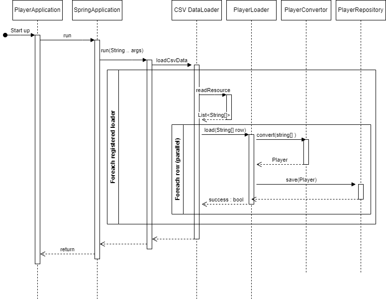

Player Microservice
===================

Startup - DB Seed Process (PlayerDB)
------------------------------------

`Notes`
-------
`Assumptions and Limitations`
* The Player CSV should be sanitised further and when loading it there should be better edge case handling
  * fallback to default values
  * keeping a dictionary (in memory or using an api or some sort of external service) of places to handle ambiguous locations
  * conversion of date should be better handled
* The initial load parallelize the row loading (8 threads at a time)
  * this could be fine-tuned to get the best startup loading time
  * this could be further parallelized between loaders (currently there is only one the PlayerLoader)
* The API should add a user input validation phase (especially for the get player by id)

`Deployment`
* The deployment process should take into consideration that the Player database is probably seeded/loaded already, and have some sort of seeding process that is not related to the startup of this MS
* Deployment should automatically trigger the unit tests, and the (not implemented yet) Integration and API tests
  * preferably with GitHub action, and connection to a Jenkins job

`Structure`
* The project structure is not optimal but enables a shift to a better structure
  * one that will separate the Interfaces from the actual implementations ( I kept them within the same directory)
  * optimally the implementations would be in a separate project and have a reference to the interface declarations
  * then the reference could be done by some-kind of Artifactory, keeping track of versions

`Future-proofing`
* Creating more csv loaders is possible, that way there could be multiple .csv files to load to different repositories
* The DB engine is H2, and in real life (or when we take this to production) this would need to be replaced with a persistent layer (not in mem) such as mysql or postgres
  * it would be simple to replace the engine, with the application properties of this SpringBoot project
* Monitoring of the usage of this API MS, and next phase would need to consider caching of "popular" players/teams, should the data indicate so.

`Summary`
---------
Overall - I had fun
\
I admit I felt a bit rusty, 
\
But that feeling was only fueling me to continue and improve the code 
\
and recall how I love the Spring Framework and the Java Ecosystem. 